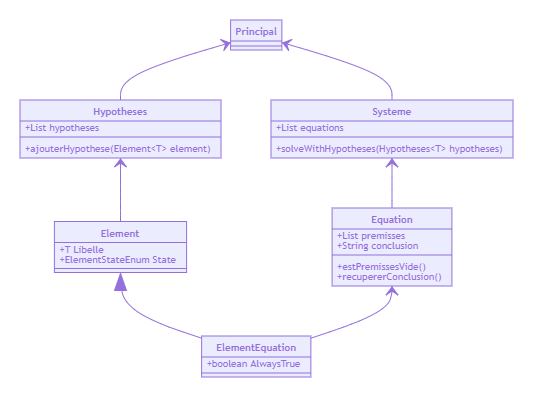

# UTBM SI73 TP Systeme Expert

**Schéma**:

```plaintext
-----------------
|               |
|  -----------  |
|  | Base de |  |
|  |  faits  |  |           ----------------
|  |---------|  |<--------->|    Moteur    |
|  | Base de |  |           | d'inférences |
|  | règles  |  |           ----------------
|  -----------  |
|               |
-----------------
```

**Faits**:

- (not) moteurDemarre
- pharesFonctionnent

**Règles**:

1. (not) reservoirVide (and) pharesFonctionnent (and) (not) moteurDemarre => problemeBougie$
2. (not) moteurDemarre (and) (not) pharesFonctionnent => problemeBatterie
3. (not) moteurDemarre (and) pharesFonctionnent => problemeStarter

**Moteur d'inférences**:

P (and) (P => Q)$ alors on peut déduire Q.

---

## Exercice

Etant donnés un système d’équations logiques S , et un ensemble de faits certains Faits, concevoir l’architecture du programme qui permet de déduire toutes les conclusions vraies.

S = { [A (and) B => X] ; [C (and) E (and) D => F] ; [X (and) D => Z] }

Hypothèses:

{ A , B , D , X , Z }  X , Z

---

## Algorithme

- **Pour** chaque *H* de *Hypothèses* **faire**
  - **Pour** chaque *Equation* *E* de *S* **faire**
    - **Si** *H* appartient à *permisse* de *E* **alors**
      - supprimer *H* de *premisse* de *E*
    - **Si** vide(*prémisse* de *E*) **alors**
      - ajouter *conclusion* de *E* à *Hypothèses*

---

## Architecture


